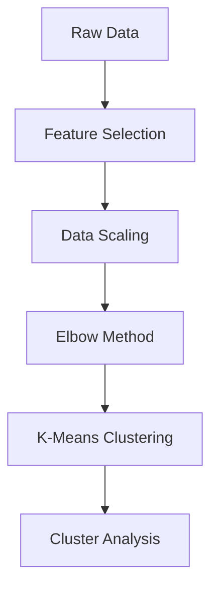

# Soccer Player Valuation Analysis

## Overview
This project analyzes and predicts soccer player market values using performance statistics, clustering techniques, and machine learning. The system processes player appearances, club data, and valuation history to provide insights into player segmentation and market value prediction.

## Key Features
- **Data Integration**: Combines player stats, club info, and valuation history
- **Player Segmentation**: K-means clustering identifies 5 distinct player profiles
- **Market Value Prediction**: XGBoost model predicts values with R²=0.87
- **Performance Analysis**: Visualizations of key metrics across clusters
- **Production-Ready**: Includes custom prediction functionality

## Technical Implementation
### Data Processing
```python
# Merged multiple datasets (players, appearances, games)
full_players_info = players.merge(appearences, on='player_id')
full_players_info = full_players_info.merge(games[['game_id','season']], on='game_id')

# Calculated age from birth dates
full_players_info['age'] = (today - full_players_info['date_of_birth']).dt.days / 365.25
```

### Clustering Analysis


### Machine Learning
- XGBoost with GPU acceleration
- GridSearchCV for hyperparameter tuning
- Feature importance analysis
- Custom prediction function
